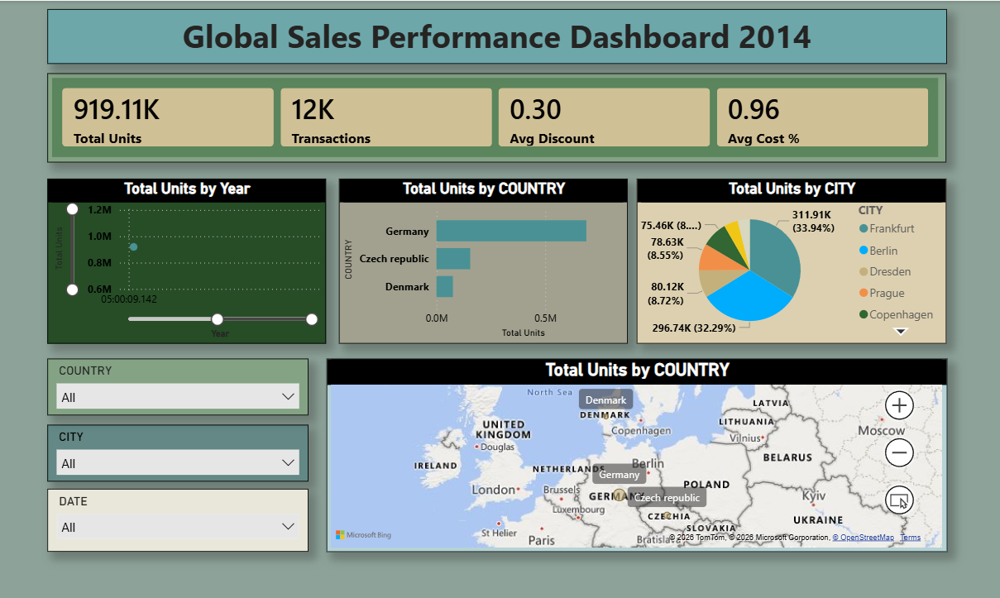
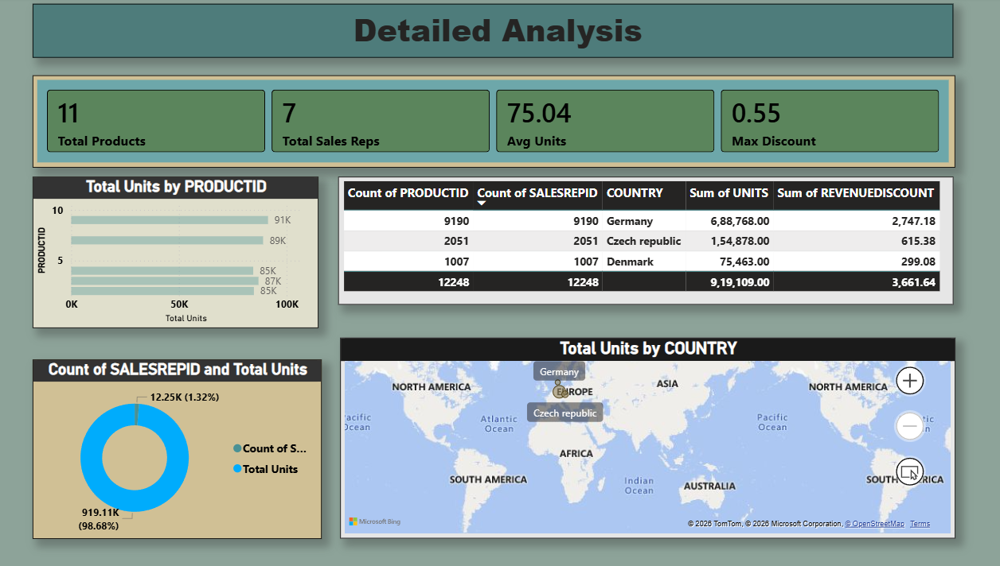

# 📊 Global Sales Performance Dashboard 2014

## 📌 Project Overview

This project demonstrates an end-to-end Business Intelligence solution using **Snowflake** and **Power BI**. The sales data is stored in Snowflake, transformed using SQL, and visualized in Power BI through interactive dashboards.

The dashboard provides business insights into sales performance across countries, cities, products, and sales representatives using KPIs, charts, maps, and DAX measures.

---

# 🚀 Tech Stack

- 📊 Power BI Desktop
- ❄️ Snowflake Cloud Data Warehouse
- 🗄 SQL
- 📈 DAX (Data Analysis Expressions)
- 📄 CSV Dataset
- 💻 GitHub

---

# 📂 Project Workflow

```text
CSV Dataset
      │
      ▼
Snowflake Database
      │
      ▼
SQL Data Loading
      │
      ▼
Power BI Connection
      │
      ▼
Data Modeling
      │
      ▼
DAX Measures
      │
      ▼
Interactive Dashboard
```

---

# 🗄 Snowflake Setup

### Database
```
SALES_DB
```

### Schema
```
SALES_SCHEMA
```

### Warehouse
```
SALES_WH
```

### Table
```
SALES_2014
```

---

# 📥 Data Loading

The dataset was loaded into Snowflake using SQL.

### Steps Performed

- Created Database
- Created Schema
- Created Warehouse
- Created Table
- Uploaded CSV File
- Loaded Data into Snowflake
- Validated Records

**Total Records Loaded**

```
12,248 Rows
```

---

# 📊 Dashboard Preview

## 📌 Page 1 – Global Sales Performance Dashboard



### Dashboard Includes

- Total Units KPI
- Total Transactions KPI
- Average Discount KPI
- Average Cost Percentage KPI
- Monthly Sales Trend
- Total Units by Country
- Total Units by City
- Sales Distribution Map
- Country, City & Date Filters

---

## 📌 Page 2 – Sales Performance Analysis



### Dashboard Includes

- Total Products
- Total Sales Representatives
- Average Units
- Maximum Discount
- Top 5 Products by Total Units
- Total Units by Sales Representative
- Country Summary Table
- Sales Distribution Map

---

# 📈 DAX Measures

```DAX
Total Units =
SUM(SALES_2014[Units])

Transactions =
COUNTROWS(SALES_2014)

Average Discount =
AVERAGE(SALES_2014[RevenueDiscount])

Average Cost % =
AVERAGE(SALES_2014[PercentOfStandardCost])

Total Products =
DISTINCTCOUNT(SALES_2014[ProductID])

Total Sales Reps =
DISTINCTCOUNT(SALES_2014[SalesRepID])

Average Units =
AVERAGE(SALES_2014[Units])

Maximum Discount =
MAX(SALES_2014[RevenueDiscount])
```

---

# 📌 Dashboard Features

✅ Snowflake Integration

✅ Power BI Dashboard

✅ SQL Data Loading

✅ DAX Measures

✅ Interactive KPIs

✅ Bar Charts

✅ Pie/Donut Charts

✅ Map Visualization

✅ Slicers

✅ Business Insights

---

# 📁 Repository Structure

```
Global-Sales-Performance-Dashboard/
│
├── README.md
├── Snowflake_Setup.sql
├── Sales_2014.pbix
├── Sales2014.csv
├── Dashboard_Page1.png
├── Dashboard_Page2.png
└── LICENSE
```

---

# 📚 Key Learnings

- Snowflake Database Management
- SQL Data Loading using COPY INTO
- Power BI Data Modeling
- DAX Measure Creation
- Interactive Dashboard Design
- Business Intelligence Reporting

---

# 👩‍💻 Author

## Keerthana Pami Setty

## ⭐ If you found this project useful, please give it a Star ⭐
